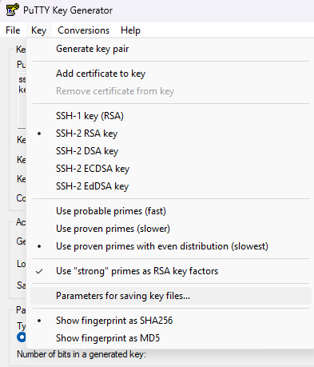

# ansible-lgsm-l4d-l4d2

> :warning: You need to have some experience with Ansible and left4dead games before using this repo !

# Example of a basic ansible configuration

## 1/ On the ansible controller (tested on Debian 12)

As root user :

Install requirements packages :

```bash
apt-get install sudo openssh-server openssh-client whois python3 python3-apt python3-venv python3-full git
```

Create a user ansible with sudo group :

```bash
controlleruser=ansible
adduser "${controlleruser}"
usermod -aG sudo "${controlleruser}"
```

Add NOPASSWD sudo + hardening sudoers :

```bash
echo "${controlleruser} ALL=(ALL) NOPASSWD: ALL" > /etc/sudoers.d/"${controlleruser}"
chmod 750 /etc/sudoers.d
chmod 440 /etc/sudoers.d/"${controlleruser}"
```

Install ansible package with python3 environnement as ansible user :

```bash
su - "${controlleruser}"
python3 -m venv --upgrade-deps ~/venv
echo "source ~/venv/bin/activate" | tee -a ~/.profile
source ~/venv/bin/activate
pip install ansible ansible-core ansible-lint
```

Generate a ssh key as ansible user :

> :warning: Accepted hostkey rsa minimun 4096 bits and ed25519

Recommended : ed25519

```bash
ssh-keygen -o -a 256 -t ed25519 -C "${USER}@${HOSTNAME}" -f ~/.ssh/id_ed25519_ansible -N ""
```

or rsa

```bash
ssh-keygen -o -a 256 -t rsa -b 4096 -C "${USER}@${HOSTNAME}" -f ~/.ssh/rsa_ansible -N ""
```

Download repository :

```bash
git clone https://github.com/fbapt/ansible-lgsm-l4d-l4d2.git ~/ansible-lgsm-l4d-l4d2
```

## 2/ On each ansible nodes

As root user :

Install requirements package :

```bash
apt-get install sudo openssh-server python3 python3-apt cron
```

Create a user ansible with sudo group :

```bash
nodeuser=ansible
adduser "${nodeuser}"
usermod -aG sudo "${nodeuser}"
```

Add NOPASSWD sudo + hardening sudoers :

```bash
echo "${nodeuser} ALL=(ALL) NOPASSWD: ALL" > /etc/sudoers.d/"${nodeuser}"
chmod 750 /etc/sudoers.d
chmod 440 /etc/sudoers.d/"${nodeuser}"
```

Save ip of each ansible nodes :

```bash
ip a
```

## 3/ On the ansible controller

As ansible user, copy ssh key with user and ip of each ansible nodes :

```bash
nodeip=x.x.x.x
nodeuser=ansible
sshtype=ed25519 or rsa
ssh-copy-id -i ~/.ssh/id_"${sshtype}"_ansible.pub "${nodeuser}@${nodeip}"
```

# Configuration and installation

## 1/ Configure files of left4dead1 and/or left4dead2

If you are on vscode add this to your c:/Users/USER/AppData/Roaming/Code/User/settings.json

```bash
    ..........,
	"terminal.integrated.shellArgs.linux": ["-l"],
	"terminal.integrated.defaultProfile.linux": "bash",
	"terminal.integrated.profiles.linux": {
	  "bash": {
		"path": "/bin/bash",
		"icon": "terminal-bash",
		"args": [ "-l" ]
	  },
	}
```

Edit files :

- inventory/lgsmhosts.yml

	*Change parameters of your host

- host_vars/production/production.yml

	*Change parameters as you want

	*(optional) : create ssh keys if you want to use playbook configure_ssh_iptables.yml :

> :warning: You need to create each user ssh key (l4d1,l4d2) on your server and download it on your computer !

> Accepted hostkey rsa minimun 4096 bits and ed25519 for security

I assume you are on Windows :

use a sofware such as PuTTYgen + pageant (include in PuTTY)...

In PuTTYgen for security tick :

"Use proven primes with even distribution (slowest)" and "Use "strong" primes as RSA key factors"



Click on RSA with 4096 bits or EdDSA(recommended) and Generate

Add a passphrase that should be at least 26 characters for security

Edit "ssh-keys:" and copy paste public key

File --> Save private key

Load key with pageant --> Add key

- host_vars/production/vault.yml

	*Use a strong user password

	*.vault_pass :

Comment line in file ansible.cfg  --> #vault_password_file=.vault_pass

change password (example for debian12testing)

```bash
ansible-vault rekey host_vars/debian12testing/vault.yml
```

Uncomment line in file ansible.cfg  --> vault_password_file=.vault_pass

Edit .vault_pass with the new password

- Add l4d1/2 configuration files in each roles if variables in host_vars/production/production.yml are on true, examples :

	## In role/lgsminstallation/files/l4d[2]server/lgsm_cfg

	put file like l4dserver.cfg

	## In role/lgsminstallation/files/l4d[2]server/server

	put file like host.txt or mymotd.txt

	## In role/lgsminstallation/files/l4d[2]server/server_cfg

	put file like server.cfg, l4dserver.cfg

	## In role/maps/files/l4d[2]server/maps

	put maps not on the steam workshops

	## In role/maps/files/l4d2server/maps/workshops

	put workshops maps in workshops folder for l4d2 only

	## In role/metamod/files/l4d[2]server/metamod_plugins

	put files in metamod folder

	## In role/sourcemod/files/l4d[2]server/sourcemod_plugins

	put files in addons and cfg/sourcemod folders

	## In role/strippersource/files/l4d[2]server/stripper_cfg

	put cfg maps in dumps and maps folders

## 2/ Installation of left4dead1 and/or left4dead2 dedicated servers

On the ansible controller, as ansible user run playbooks on a Debian 11 or 12 :

Install left4dead1 and/or left4dead2 dedicated servers :

```bash
ansible-playbook system_update.yml --limit production
ansible-playbook lgsm.yml --limit production
```

(optional) configure hardening firewall + ssh with creation of ssh keys (sshd_config is restricted to IPV4 and accept only ssh keys) :

```bash
ansible-playbook configure_ssh_iptables.yml --limit production
```

(optional) improve performance of the server :

```bash
ansible-playbook performance.yml --limit production
```

## About

Playbooks have been tested with packages of ansible community (9.4.0), ansible-core (2.16.6) and ansible-lint (24.2.2).

Tested on Debian 11 and 12

Documentation of lgsm :

https://docs.linuxgsm.com/

https://linuxgsm.com/servers/l4dserver/

https://linuxgsm.com/servers/l4d2server/

Documentation of Ansible :

[https://docs.ansible.com/ansible/latest/getting_started/index.html](https://docs.ansible.com/ansible/latest/getting_started/index.html)
